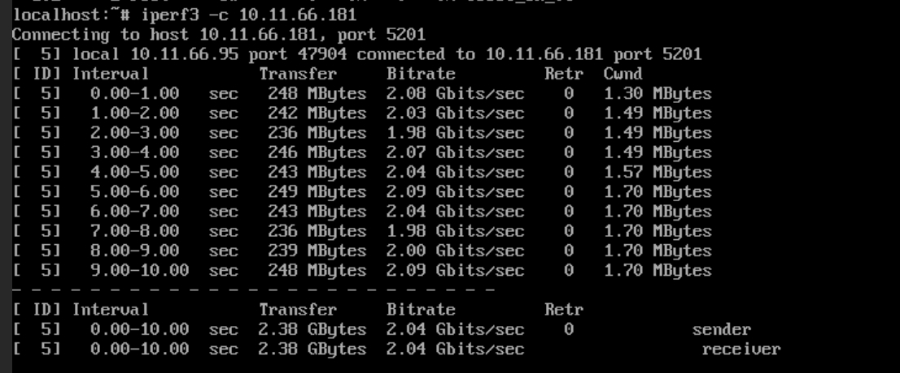
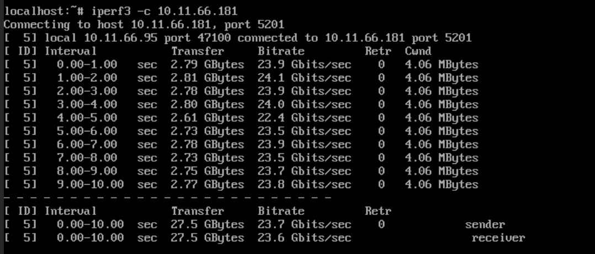
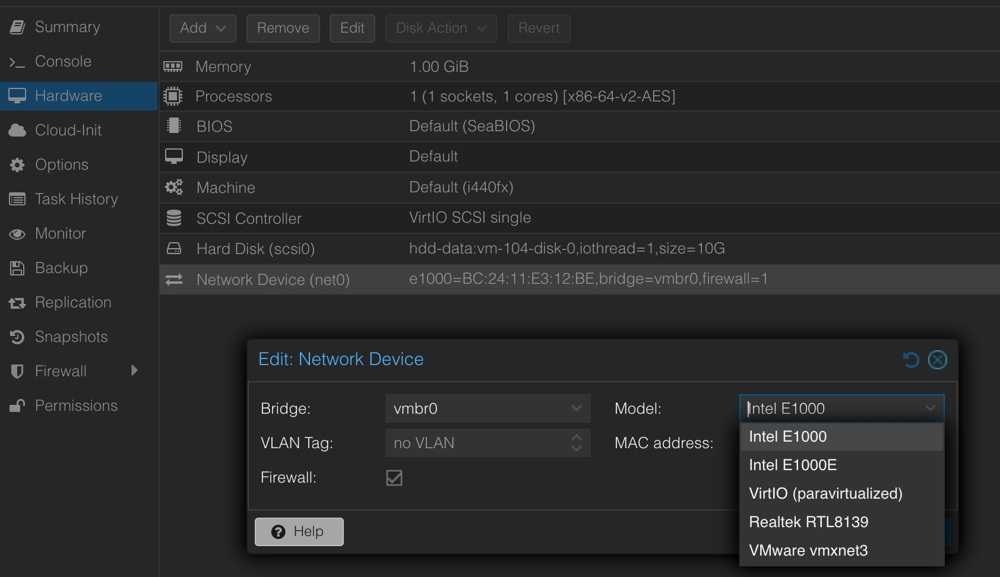

When using VM in proxmox, should prefer to use `VirtIO` as network device instead of `E1000`. As `VirtIO` has better performance. From my experiment, it's a 10x boost.

But if `VirtIO` doesn't work, you can rely on `E1000`.

# iperf test with E1000

# iperf test with VirtIO

# how to config in proxmox
